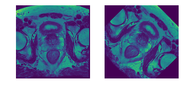
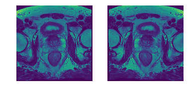
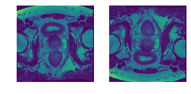
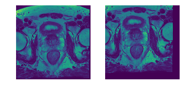
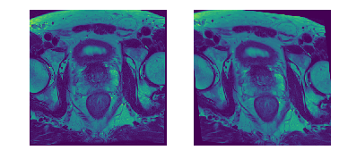
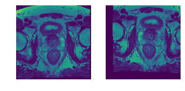
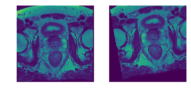
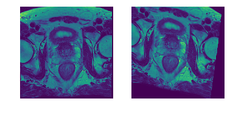
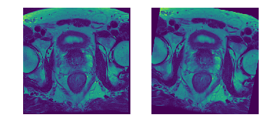

## 3D Augmentation module examples

A module implemented for the purpose of augmenting 3D volumes.<br>
This class uses transformations in SimpleITK library to perform augmentations. 


```python
from augmentation3DUtil import Augmentation3DUtil
from augmentation3DUtil import Transforms
import SimpleITK as sitk
import matplotlib.pyplot as plt
%matplotlib inline
```

### Reading image using SimpleITK module


```python
img = sitk.ReadImage(fr"I:\Projects\Data\ProstateX1\1_Original\ProstateX1_0000_L1\T2W.nii.gz")
```

### Performing single transformations 

Use the Enum class Transforms for defining transforms. See examples below

#### Rotation
parameters
probability : probability of the executing this particular transformation <br>
degrees : degree of rotation. 


```python
au = Augmentation3DUtil(img,mask=None)
au.add(Transforms.ROTATE2D,probability = 1, degrees = 45)

img,re = au.process(1)

arr = sitk.GetArrayFromImage(img)
augarr = sitk.GetArrayFromImage(re[0][0])

plt.subplot(121)
plt.imshow(arr[10])
plt.axis('off')
plt.subplot(122)
plt.imshow(augarr[10])
plt.axis('off')
```


    (-0.5, 383.5, 383.5, -0.5)





#### Flip horizontal 
parameters
probability : probability of the executing this particular transformation <br>


```python
au = Augmentation3DUtil(img,mask=None)
au.add(Transforms.FLIPHORIZONTAL,probability = 1)

img,re = au.process(1)

arr = sitk.GetArrayFromImage(img)
augarr = sitk.GetArrayFromImage(re[0][0])

plt.subplot(121)
plt.imshow(arr[10])
plt.axis('off')
plt.subplot(122)
plt.imshow(augarr[10])
plt.axis('off')
```


    (-0.5, 383.5, 383.5, -0.5)





#### Flip vertical 
parameters
probability : probability of the executing this particular transformation <br>


```python
au = Augmentation3DUtil(img,mask=None)
au.add(Transforms.FLIPVERTICAL,probability = 1)

img,re = au.process(1)

arr = sitk.GetArrayFromImage(img)
augarr = sitk.GetArrayFromImage(re[0][0])

plt.subplot(121)
plt.imshow(arr[10])
plt.axis('off')
plt.subplot(122)
plt.imshow(augarr[10])
plt.axis('off')
```


    (-0.5, 383.5, 383.5, -0.5)





#### Translation 
parameters
probability : probability of the executing this particular transformation <br>
offset : 3D cordinates in mm ex. (5,5,0)


```python
au = Augmentation3DUtil(img,mask=None)
au.add(Transforms.TRANSLATE,probability = 1, offset = (15,15,0))

img,re = au.process(1)

arr = sitk.GetArrayFromImage(img)
augarr = sitk.GetArrayFromImage(re[0][0])

plt.subplot(121)
plt.imshow(arr[10])
plt.axis('off')
plt.subplot(122)
plt.imshow(augarr[10])
plt.axis('off')
```


    (-0.5, 383.5, 383.5, -0.5)





#### Shear 
parameters
probability : probability of the executing this particular transformation <br>
magnitude : 3D cordinates 


```python
au = Augmentation3DUtil(img,mask=None)
au.add(Transforms.SHEAR,probability = 1, magnitude = (0.1,0.1))

img,re = au.process(1)

arr = sitk.GetArrayFromImage(img)
augarr = sitk.GetArrayFromImage(re[0][0])

plt.subplot(121)
plt.imshow(arr[10])
plt.axis('off')
plt.subplot(122)
plt.imshow(augarr[10])
plt.axis('off')
```


    (-0.5, 383.5, 383.5, -0.5)





### Random sampling of transformations (combination)
specify the number of samples to be obtained using "process" method<br>
specify the likelihood of a particular transform as probabilities.  


```python
au = Augmentation3DUtil(img,mask=None)
au.add(Transforms.SHEAR,probability = 0.25, magnitude = (0.05,0.05))
au.add(Transforms.TRANSLATE,probability = 0.75, offset = (15,15,0))
au.add(Transforms.ROTATE2D,probability = 0.75, degrees = 10)
au.add(Transforms.FLIPHORIZONTAL,probability = 0.75)

img,re = au.process(5)

for i in range(len(re)):
    arr = sitk.GetArrayFromImage(img)
    augarr = sitk.GetArrayFromImage(re[i][0])

    plt.subplot(121)
    plt.imshow(arr[10])
    plt.axis('off')
    plt.subplot(122)
    plt.imshow(augarr[10])
    plt.axis('off')
    plt.show()

```













